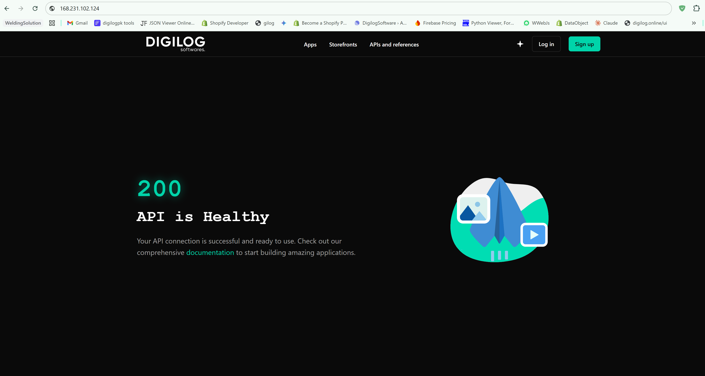
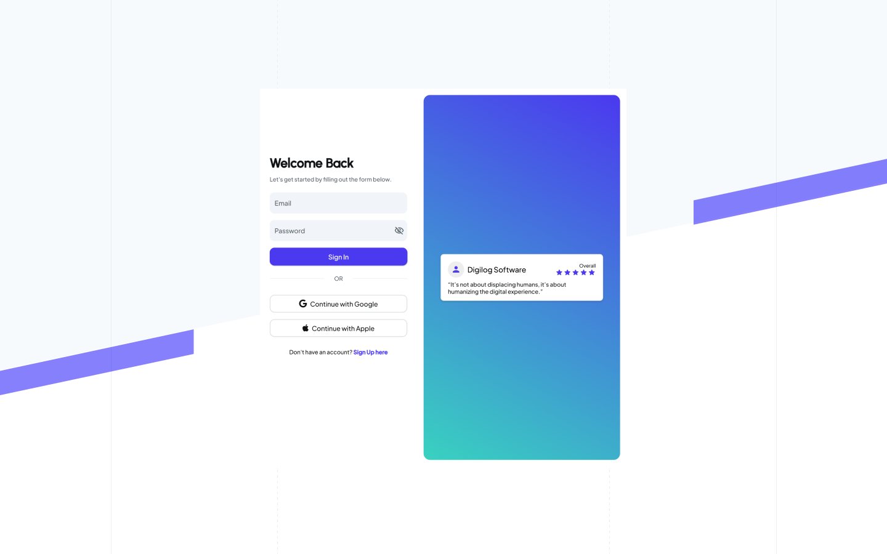
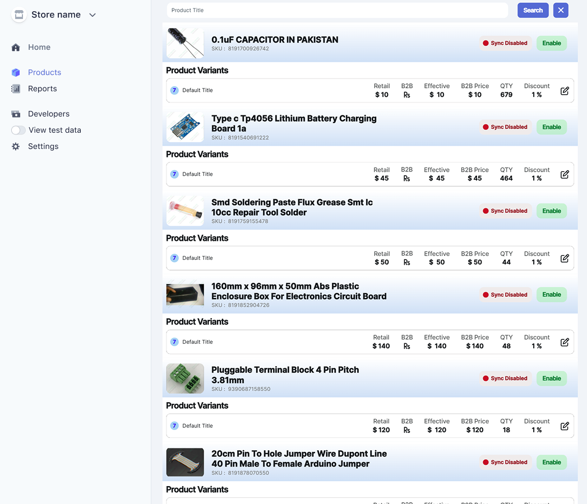
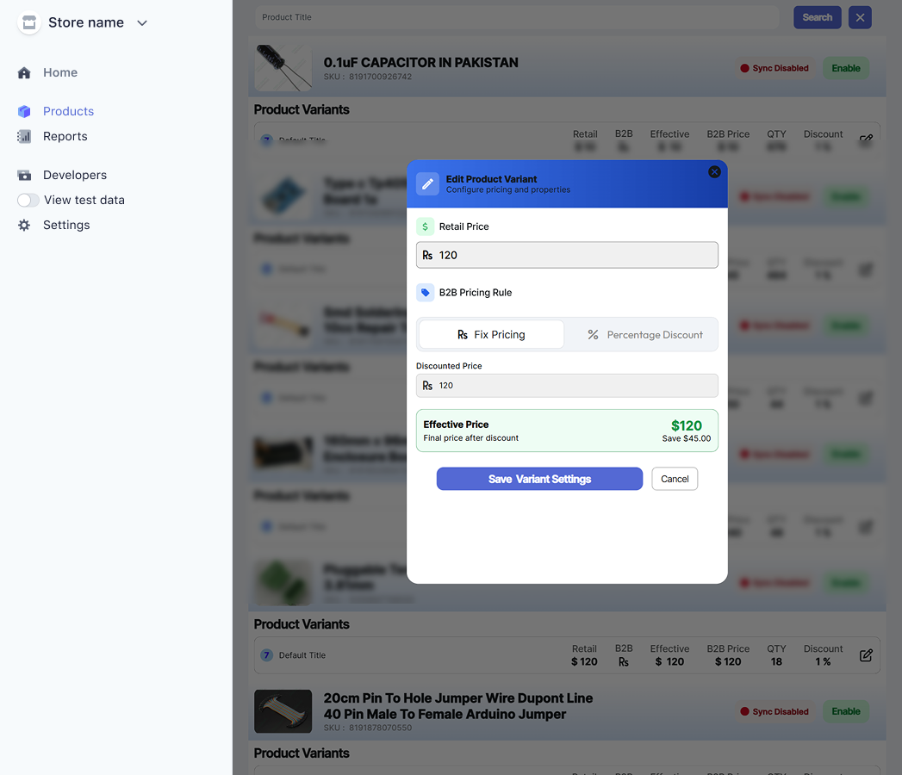
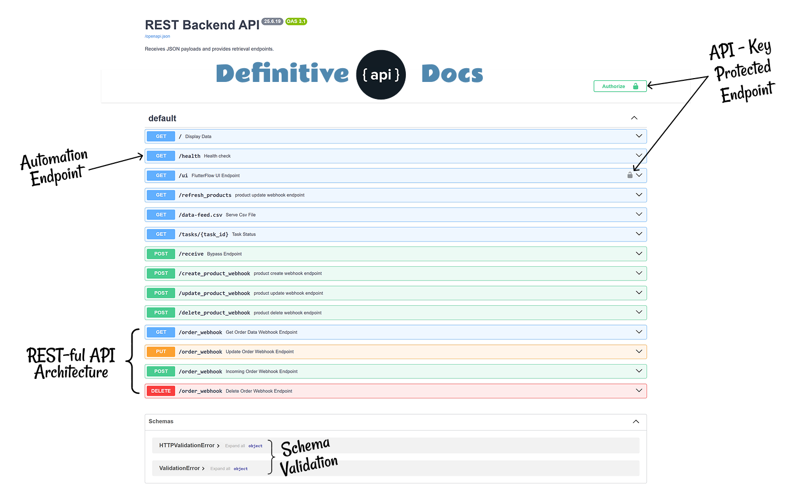
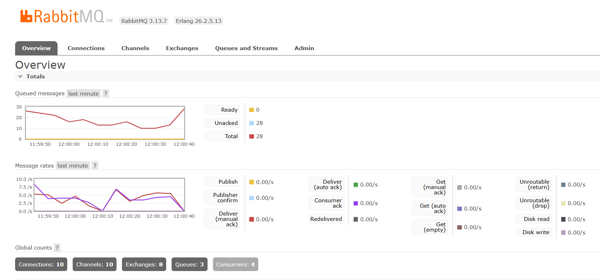
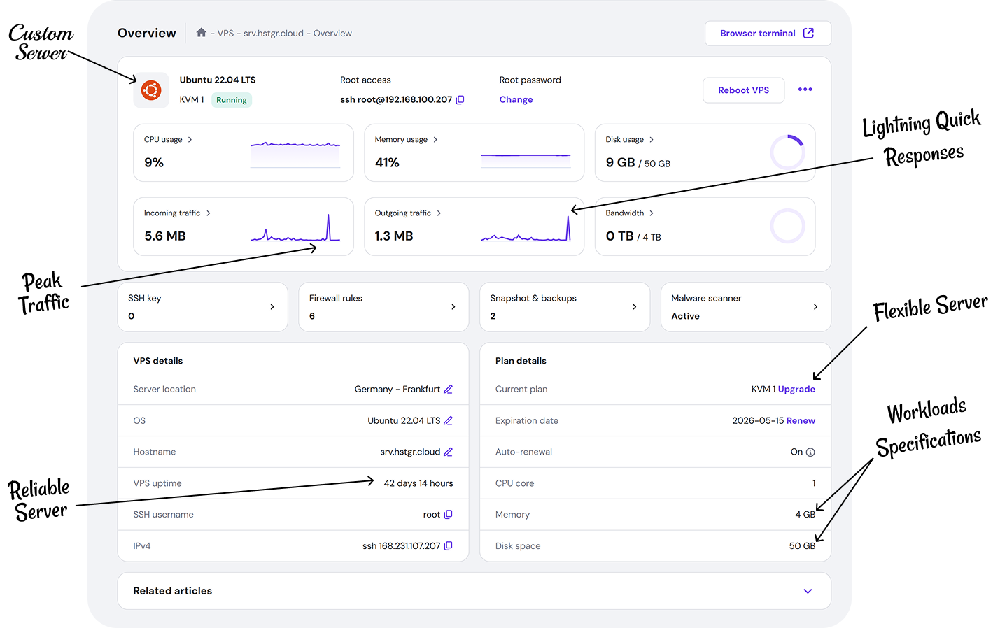
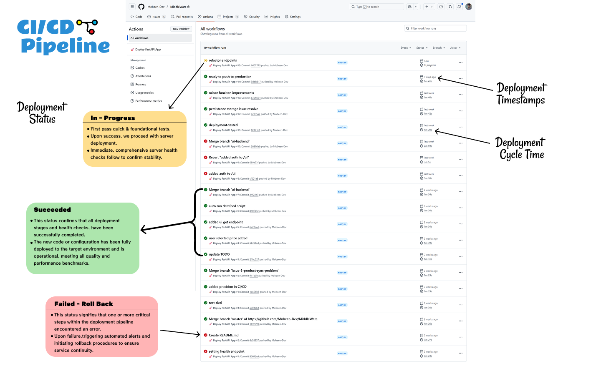

# Media Showcase

This page highlights key visuals from the project. Each image represents an important part of the system design and workflow.

---

## System Design
Syncing WorkFlow

---

## API Overview
Fully Responsive webpage for Alternate to Login Page Deployed to Custom URL

---

## User Interface – Login
Manage products with ease: edit details, enable/disable sync, set custom prices, search items, and view real-time performance insights

---

## User Interface – Home
Manage products with ease: edit details, enable/disable sync, set custom prices, search items, and view real-time performance insights

---

## User Interface – Actions
View pricing rules per product see retail price, applied rule, and final B2B price. Instantly understand how each rule affects pricing

---

## REST API Architecture
REST API docs with full endpoint structure. Routes are secured with API keys, and background logic ensures stable, authenticated operations

---

## Messaging Queue
Queue System to handle High Traffic on Server with best Latency in Production

---

## Server Architecture
Monitor server performance: view high-income traffic, instant response times, customer activity, and deployment status in real time.

---

## CI/CD Pipeline
Track deployments over time. Ensure faster releases, safe rollbacks, and stable updates with CI/CD automation for reliable production flow

